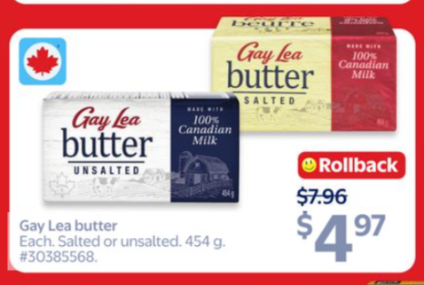

# image2offer

`image2offer` is an agentic AI pipeline that reads a flyer/promo image and returns structured offer data in JSON.

The core idea is simple:
- Input: one image (for example, an offer from supermarket flyer, a website or a poster).
- Output: normalized offer objects with price, original price, currency, and product details.

## How the agentic AI works

The main logic lives in the LangGraph pipeline (`I2OGraph`) under `src/graph`.
Each node has one clear job, and the state is passed from node to node.

1. **Image Check Node**  
   Checks if the image actually contains an offer.

2. **Offer Info Extraction Node**  
   Reads the image and extracts raw offer information.

3. **Product Enrichment Node**  
   Improves product details using model reasoning (and optional web search).

4. **Product Image Search Node** (optional)  
   Finds product image URLs online when enabled.

5. **Final Offer Composition Node**  
   Merges all previous outputs into the final clean JSON structure.

This agentic flow is the main value of the project.  
The web demo is only a simple UI to run this same pipeline online.

## Online demo

You can try it here: [https://image2offer-webdemo.onrender.com](https://image2offer-webdemo.onrender.com)

## Example (Walmart image -> final result)

Example input image: Walmart flyer example from `webdemo_render` flow (`example_2_us_walmart.png`).



Example final output:

```json
[
    {
        "offer_currency": "USD",
        "offer_price": 4.97,
        "original_price": 7.96,
        "country_of_origin": "US",
        "offer_products": [
            {
                "country": "US",
                "brand": "Gay Lea",
                "name": "Unsalted Butter",
                "image_url": null,
                "barcodes": {"UPC": ["066013905619"]},
                "quantities": [454.0],
                "units": ["g"],
                "product_line": "Unsalted Butter",
                "category": "butter",
                "sub_category": "unsalted butter"
            }
        ]
    },
    {
        "offer_currency": "USD",
        "offer_price": 4.97,
        "original_price": 7.96,
        "country_of_origin": "US",
        "offer_products": [
            {
                "country": "US",
                "brand": "Gay Lea",
                "name": "Salted Butter (454 g)",
                "image_url": null,
                "barcodes": {"UPC": ["066013598620"]},
                "quantities": [454.0],
                "units": ["g"],
                "product_line": "Salted Butter",
                "category": "butter",
                "sub_category": "salted butter"
            }
        ]
    }
]


```

## Example (Taiwan PXMart image -> final result)

Example input image: PXMart flyer example from `webdemo_render` flow (`example_5_taiwan_pxmart.png`).


Example final output:

```json
[
  {
    "offer_currency": "TWD",
    "offer_price": 538,
    "original_price": 1076,
    "country_of_origin": "Taiwan",
    "offer_products": [
      {
        "country": "Taiwan",
        "brand": "Colgate",
        "name": "高露潔抗敏好口氣牙膏",
        "image_url": null,
        "barcodes": {
          "EAN": null,
          "UPC": null,
          "ASIN": null
        },
        "quantities": [3],
        "units": ["組"],
        "product_line": "抗敏 好口氣",
        "category": "牙膏",
        "sub_category": "抗敏牙膏／清新口氣"
      },
      {
        "country": "Taiwan",
        "brand": "Colgate",
        "name": "高露潔抗敏好口氣牙膏",
        "image_url": null,
        "barcodes": {
          "EAN": null,
          "UPC": null,
          "ASIN": null
        },
        "quantities": [3],
        "units": ["組"],
        "product_line": "高露潔抗敏好口氣",
        "category": "牙膏",
        "sub_category": "抗敏感牙膏"
      }
    ]
  }
]
```

## Libraries and tools used

- **LangGraph**: orchestrates the multi-step agent pipeline and state transitions.
- **OpenAI APIs**: power image understanding, extraction, enrichment, and final composition.
- **Render**: hosts the online demo so the pipeline can be tested quickly through a browser.
