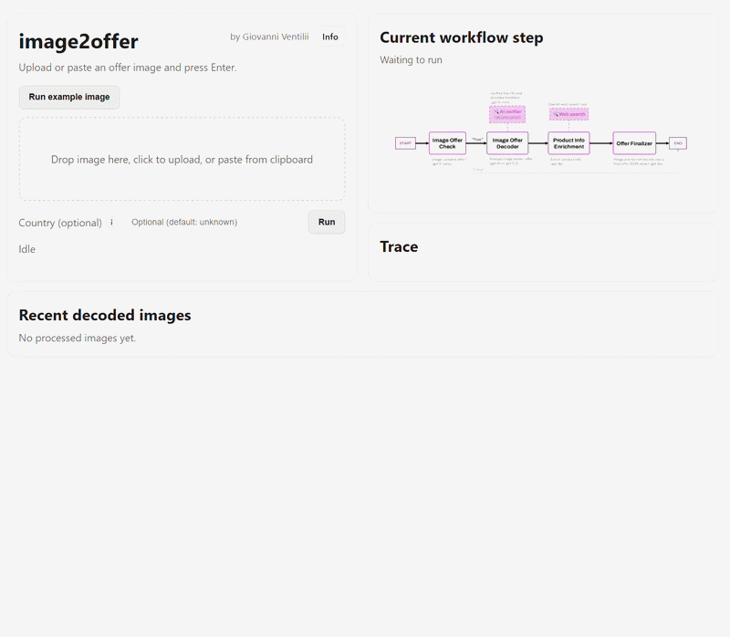
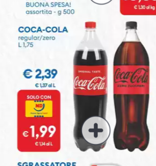
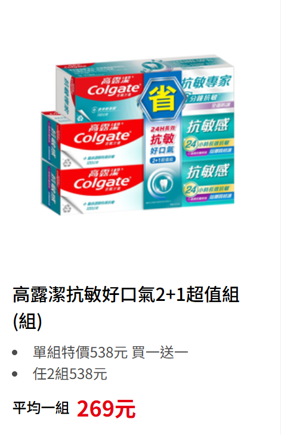
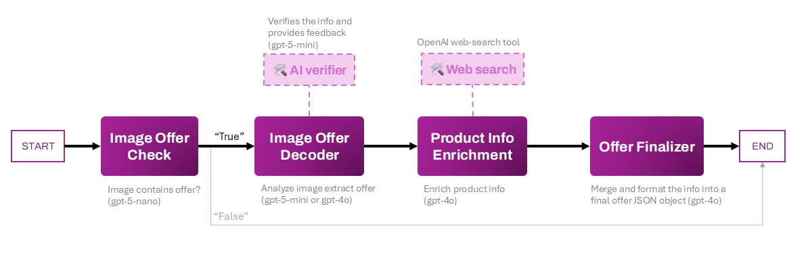

# image2offer

`image2offer` is an agentic AI pipeline that reads a promo image and returns structured offer data in JSON.

## Try the Demo

The core idea is simple:
- Input: one image (for example, an offer from supermarket flyer, a website or a poster).
- Output: normalized offer objects with price, original price, currency, offer requirements, and product details.

## How the agentic AI works

The main logic lives in the LangGraph pipeline (`I2OGraph`) under `src/graph`.
Each node has one clear job, and the state is passed from node to node.

1. **Image Check Node**  
   Checks if the image actually contains an offer.

2. **Offer Info Extraction Node**  
   Reads the image and extracts raw offer information.

3. **Product Enrichment Node**  
   Improves product details using model reasoning (and optional web search).

4. **Product Image Search Node** (optional)  
   Finds product image URLs online when enabled.

5. **Final Offer Composition Node**  
   Merges all previous outputs into the final clean JSON structure.

This agentic flow is the main value of the project.  
The web demo is only a simple UI to run this same pipeline online.

## Examples

<table style="width: 100%; table-layout: fixed;">
  <tr>
    <td width="50%" valign="top" style="text-align: center;">
      
    </td>
    <td width="50%" valign="top">
      

        <pre><code>[
  {
    "offer_currency": "EUR",
    "offer_price": 1.99,
    "original_price": 2.39,
    "prices_per_quantities": [1.14],
    "price_per_quantity_units": ["EUR/L"],
    "offer_requirement": [],
    "country_of_origin": "Italy",
    "offer_products": [
      {
        "country": "",
        "brand": "Coca-Cola",
        "name": "Coca-Cola Regular",
        "image_url": "",
        "barcodes": {
          "EAN": [
            "5000112600179",
            "5000112528305",
            "5449000646293",
            "5000112611861"
          ],
          "UPC": None,
          "ASIN": None
        },
        "quantities": [1750],
        "units": ["ml"],
        "product_line": "Coca-Cola Regular 1.75\x7fL",
        "category": "bevanda analcolica",
        "sub_category": "bibita gassata cola"
      }
    ]
  },
  {
    "offer_currency": "EUR",
    "offer_price": 1.99,
    "original_price": 2.39,
    "prices_per_quantities": [1.14],
    "price_per_quantity_units": ["EUR/L"],
    "offer_requirement": [],
    "country_of_origin": "Italy",
    "offer_products": [
      {
        "country": "",
        "brand": "Coca-Cola",
        "name": "Coca-Cola Zero Zuccheri 1.75\x7fL",
        "image_url": "",
        "barcodes": {
          "EAN": [
            "5000112600186",
            "5000112600193"
          ],
          "UPC": None,
          "ASIN": None
        },
        "quantities": [1750],
        "units": ["ml"],
        "product_line": "Coca-Cola Zero Zuccheri PET 1.75\x7fL",
        "category": "bevanda gassata",
        "sub_category": "cola senza zuccheri"
      }
    ]
  }
]</code></pre>
      

    </td>
  </tr>
  <tr>
    <td width="50%" valign="top" style="text-align: center;">
      
    </td>
    <td width="50%" valign="top">
      

        <pre><code>[
  {
    "offer_currency": "TWD",
    "offer_price": 538,
    "original_price": 1076,
    "prices_per_quantities": [269],
    "price_per_quantity_units": ["TWD/組"],
    "offer_requirement": ["限會員卡"],
    "country_of_origin": "Taiwan",
    "offer_products": [
      {
        "country": "",
        "brand": "Colgate",
        "name": "高露潔 抗敏好口氣 牙 膏",
        "image_url": "",
        "barcodes": {
          "EAN": ["4710168719848"],
          "UPC": None,
          "ASIN": None
        },
        "quantities": [3],
        "units": ["條"],
        "product_line": "全效 口氣健康專家",
        "category": "牙膏",
        "sub_category": "清新口氣／抗敏感"
      },
      {
        "country": "",
        "brand": "Colgate",
        "name": "高露潔 抗敏好口氣 牙 膏",
        "image_url": "",
        "barcodes": {
          "EAN": ["4710168719848"],
          "UPC": None,
          "ASIN": None
        },
        "quantities": [3],
        "units": ["條"],
        "product_line": "全效 口氣健康專家",
        "category": "牙膏",
        "sub_category": "清新口氣／抗敏感"
      }
    ]
  }
]</code></pre>
      

    </td>
  </tr>
</table>

## Agentic Graph Representation

## Libraries and tools used

- **LangGraph**: orchestrates the multi-step agent pipeline and state transitions.
- **OpenAI APIs**: power image understanding, extraction, enrichment, and final composition.
- **Render**: hosts the online demo so the pipeline can be tested quickly through a browser.
